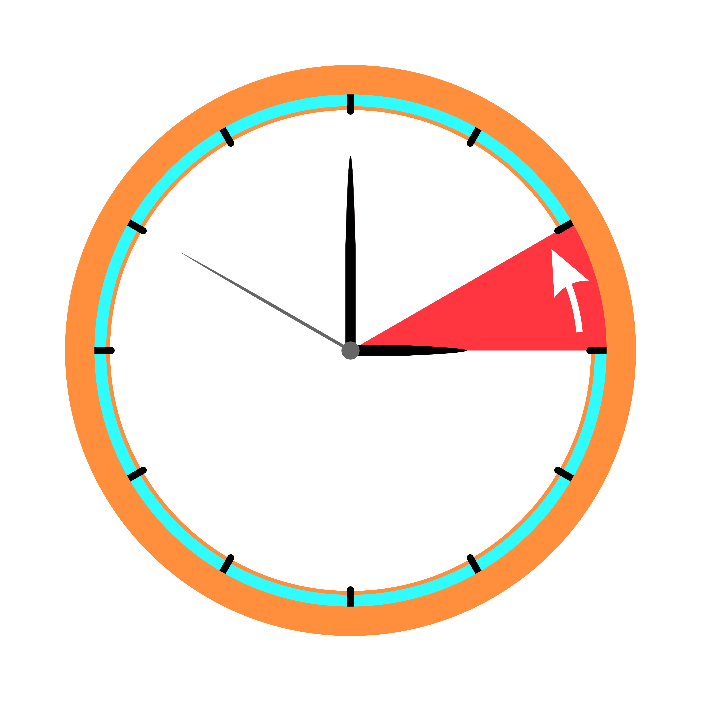

<!--
*** Thanks for checking out the Best-README-Template. If you have a suggestion
*** that would make this better, please fork the repo and create a pull request
*** or simply open an issue with the tag "enhancement".
*** Thanks again! Now go create something AMAZING! :D
***
***
***
*** To avoid retyping too much info. Do a search and replace for the following:
*** github_username, repo_name, twitter_handle, email, project_title, project_description
-->

<!-- PROJECT SHIELDS -->
<!--
*** I'm using markdown "reference style" links for readability.
*** Reference links are enclosed in brackets [ ] instead of parentheses ( ).
*** See the bottom of this document for the declaration of the reference variables
*** for contributors-url, forks-url, etc. This is an optional, concise syntax you may use.
*** https://www.markdownguide.org/basic-syntax/#reference-style-links
-->
[![Contributors][contributors-shield]][contributors-url]
[![Forks][forks-shield]][forks-url]
[![Stargazers][stars-shield]][stars-url]
[![Issues][issues-shield]][issues-url]

<!-- PROJECT LOGO -->
 

  

  <h3 align="center">Abesent</h3>

  

    Sebuah alat berbasis arduino yang digunakan untuk absen dengan fitur scanning FRID/Fingerprint/Face recognition lalu diproses ke Website/Web server. 
    Untuk mengembangkan project ini anda dapat mempelajari beberapa 2 dasar bahasa pemograman yaitu <a href="https://www.w3schools.com/cpp/">C++</a> dan <a href="https://www.w3schools.com/PHP/">PHP</a>.
     
    <a href="https://github.com/sayadedi00/absen.me"><strong>Baca dokumen »</strong></a>
     
     
    <a href="https://github.com/sayadedi00/absen.me">Lihat demo</a>
    ·
    <a href="https://github.com/sayadedi00/absen.me/issues">Laporkan Bug</a>
    ·
    <a href="https://github.com/sayadedi00/absen.me/issues">Request Fitur</a>
  

<!-- TABLE OF CONTENTS -->

  
<h2 style="display: inline-block">Tabel konten</h2>

  <ol>
    <li>
      <a href="#about-the-project">Tentang project</a>
      <ul>
        <li><a href="#built-with">Dibuat menggunakan</a></li>
      </ul>
    </li>
    <li><a href="#usage">Pemakaian</a></li>
    <li><a href="#contributing">Berkontribusi</a></li>
    <li><a href="#license">Lisensi</a></li>
    <li><a href="#contact">Kontak</a></li>
    <li><a href="#acknowledgements">Ucapan Terima Kasih</a></li>
  </ol>

<!-- ABOUT THE PROJECT -->
## Tentang Project

Sebuah alat berbasis arduino yang digunakan untuk absen dengan fitur scanning FRID/Fingerprint/Face recognition lalu diproses ke Website/Web server. 
    Untuk mengembangkan project ini anda dapat mempelajari beberapa 2 dasar bahasa pemograman yaitu <a href="https://www.w3schools.com/cpp/">C++</a> dan <a href="https://www.w3schools.com/PHP/">PHP</a>.

### Dibuat dengan

* [PHP](PHP)
* [C++](C++)

<!-- USAGE EXAMPLES -->
## Pengguanan

Gunakan ini untuk menunjukkan contoh berguna tentang bagaimana proyek dapat digunakan. Tangkapan layar tambahan, contoh kode, dan dem. Anda juga dapat menautkan ke lebih banyak sumber daya.

_Untuk contoh, dapat dilihat disini [Documentation](https://github.com/sayadedi00/absen.me)_

<!-- CONTRIBUTING -->
## Kontribusi

Kontribusi adalah yang membuat komunitas open source menjadi tempat yang luar biasa untuk belajar, menginspirasi, dan berkreasi. Setiap kontribusi yang Anda berikan ** sangat dihargai **.

1. Fork project ini
2. buat Feature Branch milikmu (`git checkout -b feature/AmazingFeature`)
3. Commit yang kamu ubah (`git commit -m 'Add some AmazingFeature'`)
4. Masukan ke branch (`git push origin feature/AmazingFeature`)
5. Buka permintaan tarik

<!-- LICENSE -->
## Lisensi

Didistribusikan dibawah MIT License. Lihat `LICENSE` untuk informasi lebih lanjut.

<!-- CONTACT -->
## Kontak

Muhammad Iqbal - [@twitter_handle](https://twitter.com/sayadedi00) - email

Project Link: [https://github.com/sayadedi00/absen.me](https://github.com/sayadedi00/absen.me)

<!-- ACKNOWLEDGEMENTS -->
## Ucapan terima kasih kepada

* Allah SWT.

<!-- MARKDOWN LINKS & IMAGES -->
<!-- https://www.markdownguide.org/basic-syntax/#reference-style-links -->
[contributors-shield]: https://img.shields.io/github/contributors/sayadedi00/absen.me.svg?style=for-the-badge
[contributors-url]: https://github.com/sayadedi00/absen.me/graphs/contributors
[forks-shield]: https://img.shields.io/github/forks/sayadedi00/absen.me.svg?style=for-the-badge
[forks-url]: https://github.com/sayadedi00/absen.me/network/members
[stars-shield]: https://img.shields.io/github/stars/sayadedi00/absen.me.svg?style=for-the-badge
[stars-url]: https://github.com/sayadedi00/absen.me/stargazers
[issues-shield]: https://img.shields.io/github/issues/sayadedi00/absen.me.svg?style=for-the-badge
[issues-url]: https://github.com/sayadedi00/absen.me/issues
[license-shield]: https://img.shields.io/github/license/sayadedi00/absen.me.svg?style=for-the-badge
[license-url]: https://github.com/sayadedi00/absen.me/blob/master/LICENSE
